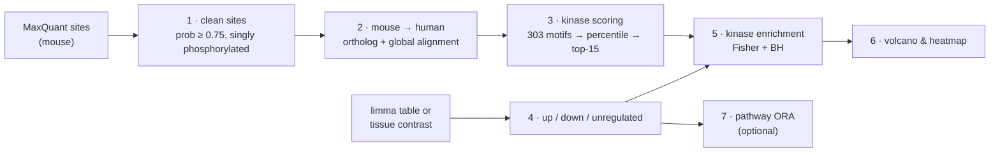
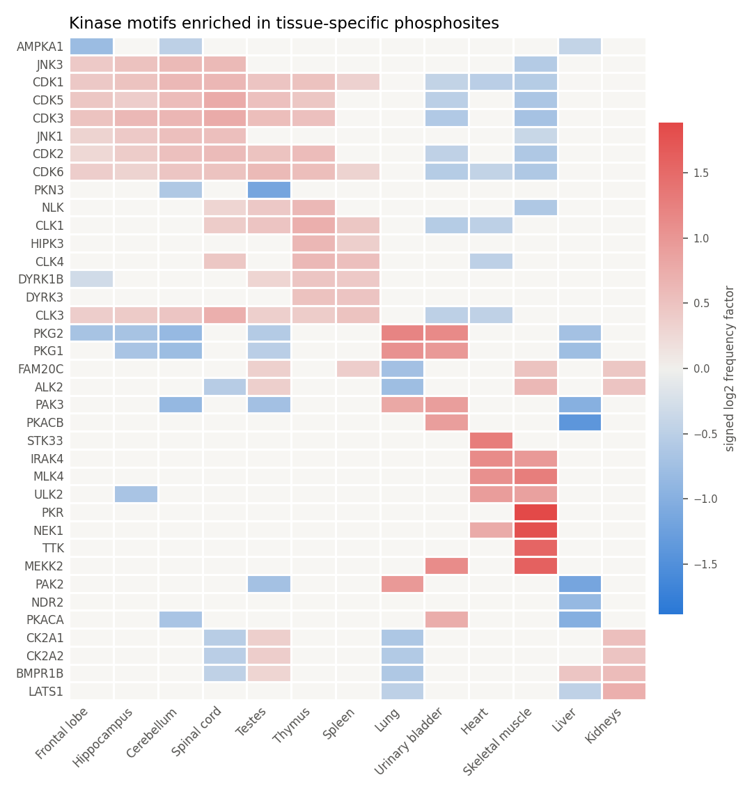
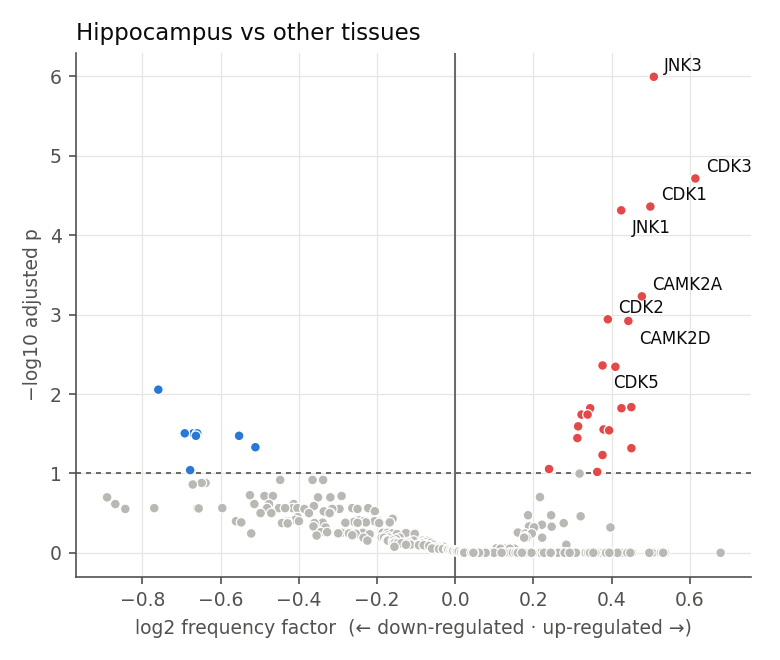
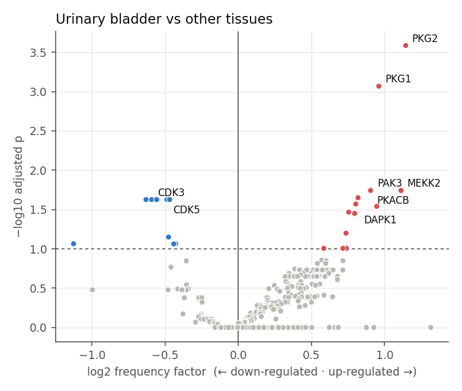

# cross-species-phosphokinase

**Which kinases drive the phosphorylation changes in a mouse experiment, judged by the human kinome atlas?**

Most kinase–substrate knowledge (and the 2023 human Ser/Thr kinome atlas) is built on
human sequences, while many in vivo phosphoproteomics studies are done in mice. This
pipeline carries mouse phosphosites across species to their human orthologous residues,
scores every site against 303 human Ser/Thr kinase motifs, and tests which kinases are
over-represented among up- or down-regulated sites.



## Demo: kinase signatures of 41 mouse tissues

Input: the mouse tissue phosphoproteome of Giansanti *et al.* (Nat. Methods 2022).
For each tissue, sites ≥ 4-fold above their median in other tissues are "up" and ≥ 4-fold
below are "down".

- **39,725** singly phosphorylated, well-localized mouse sites → **28,946** transferred to
  human residues → **28,457** Ser/Thr sites scored against all 303 kinases.
- Brain regions are enriched for neuronal kinases: in the hippocampus the top hits are
  **JNK3**, CDK1/2/3 and CDK5, and **CAMK2A** (adj. p = 6×10⁻⁴).
- Smooth-muscle-rich lung and urinary bladder are enriched for **PKG1/PKG2**, the
  cGMP-dependent kinases that relax smooth muscle.
- Proliferative thymus and testes are dominated by **CDK** motifs.

<p align="center">
  <br>
  
  
</p>

## How each step works

| Step | Script | Method |
|---|---|---|
| 1 | `1_prepare_sites.py` | Keeps sites with localization probability ≥ 0.75 from singly phosphorylated peptides; trims MaxQuant's ±15 window to ±7. |
| 2 | `2_map_to_human.py` | Checks each site against its measured sequence window (and re-locates it when the UniProt sequence version is shifted), pairs mouse and human orthologs, globally aligns the two proteins (affine-gap Needleman–Wunsch, BLOSUM62) and keeps sites whose human residue is phospho-compatible (S↔S/T, T↔S/T, Y↔Y). |
| 3 | `3_score_kinases.py` | Scores each human ±7 window with the atlas matrices (product over positions −5…+4), converts scores to percentiles of the human reference phosphoproteome and ranks kinases per site; the top 15 are the site's favoured kinases (Johnson *et al.* 2023). |
| 4 | `4_define_regulated_sites.py` | Labels sites up/down/unregulated from a limma table, or (demo) from tissue-vs-other-tissues contrasts. |
| 5 | `5_kinase_enrichment.py` | For each kinase compares its frequency among up (or down) sites with unregulated sites: log2 frequency factor, one-sided Fisher's exact test, Benjamini–Hochberg correction, Haldane correction for zero counts. |
| 6 | `6_figures.py` | Volcano plots and a tissue × kinase heatmap. |
| 7 | `7_pathway_enrichment.py` | Optional hypergeometric pathway test (e.g. Reactome GMT) with a quantified-protein background. |

## Validation

- **Kinase percentiles reproduce the published atlas.** Percentiles are interpolated from the
  published reference table, separately for Ser- and Thr-centred sites. On 9,075 held-out
  reference sites the mean error is **0.0014 percentile points** and the top-15 kinase list
  matches in **14.99 of 15** kinases on average (`results/reference_check.tsv`).
- **The aligner is exact.** The NumPy implementation is tested against a brute-force
  dynamic-programming reference on random sequences (`tests/`).
- **Two independent mapping methods agree.** Alignment-based and alignment-free (best ±7
  window match) transfer give the same human residue for **98.6%** of the 28,357 sites both
  methods map.

## Quick start

```bash
git clone https://github.com/Lily-Li-chembio/cross-species-phosphokinase.git
cd cross-species-phosphokinase
pip install -e ".[dev]"      # numpy, pandas, scipy, matplotlib, openpyxl (+ pytest)
pytest -q                    # unit tests, no downloads needed
```

Download the input tables listed in [`data/README.md`](data/README.md), then:

```bash
cd pipeline
python 1_prepare_sites.py
python 2_map_to_human.py              # ~5 min for ~10,000 proteins
python 3_score_kinases.py
python 4_define_regulated_sites.py --tissue-contrast
python 5_kinase_enrichment.py
python 6_figures.py
```

### Your own experiment

```bash
python 1_prepare_sites.py --input "Phospho (STY)Sites.txt"
python 2_map_to_human.py --orthologs gprofiler      # or a curated TSV: source_gene, human_gene
python 3_score_kinases.py
python 4_define_regulated_sites.py --limma treatment_vs_control.tsv --fc 1 --p 0.05
python 5_kinase_enrichment.py
python 6_figures.py --volcano treatment_vs_control --heatmap treatment_vs_control
```

The functions are also usable directly:

```python
from phosphokin import KinomeAtlas, kinase_enrichment

atlas = KinomeAtlas.from_supplementary("data/kinome_atlas/ST2.xlsx", "data/kinome_atlas/ST3.csv")
pct = atlas.percentile(["AAAARRASVAAAAAA"])        # PKA-like R-R-x-S site -> 1 x 303 percentiles
```

## Repository layout

```
src/phosphokin/     align.py · sequences.py · peptides.py · orthology.py
                    kinase_atlas.py · enrichment.py · pathways.py · plots.py
pipeline/           numbered scripts 1–7
tests/              unit tests on synthetic data
docs/figures/       demo figures
data/               inputs you download (not committed)
```

## Limitations

- The demo pairs orthologs by gene symbol for an offline run; `--orthologs gprofiler` or a
  curated MGI/Ensembl table is more complete.
- Tissue contrasts use site intensities without protein-level normalization, so they mix
  phosphorylation changes with protein abundance; a few very large proteins (e.g. titin in
  muscle) contribute many sites.
- Only Ser/Thr sites are scored; the atlas covers Ser/Thr kinases (a tyrosine kinome atlas
  can be added the same way).

## References

- Johnson J.L., Yaron T.M. *et al.* An atlas of substrate specificities for the human
  serine/threonine kinome. *Nature* (2023). https://doi.org/10.1038/s41586-022-05575-3
- Giansanti P., Samaras P., Bian Y. *et al.* Mass spectrometry-based draft of the mouse
  proteome. *Nat. Methods* (2022). https://doi.org/10.1038/s41592-022-01526-y

---
Li Li · [Google Scholar](https://scholar.google.com/citations?user=c7Pzo6UAAAAJ) ·
[LinkedIn](https://www.linkedin.com/in/li-li-377770115/)
